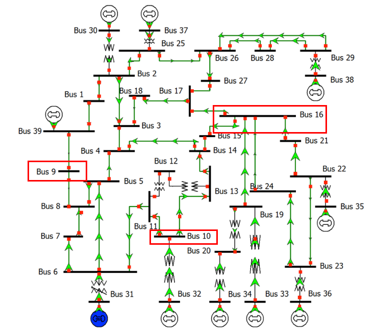
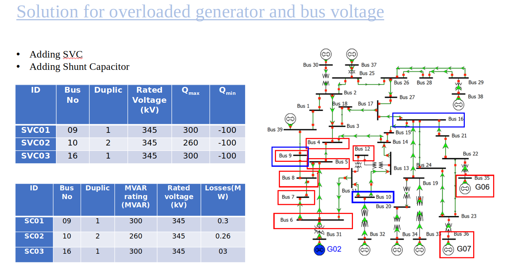

**This project was completed as for the requiremet for the coursework of EEE- 306**

## Project Name
### Investigating-The-Effect-of-HVDC-Connection-and-Large-Industrial-Loads-in-IEEE-39-Bus-Network
`This project is done using PSAF software which is designed for load flow analysis.`

## Project Details
The main objective of the project was to perform the load flow analysis of IEEE 39 bus system with the given data and examine the effect of adding HVDC line with extra transformer. Detailed explanation of the project can be found <a href= "./EEE306(C)_ProjectGuideline.pdf">here</a>. 

Analysis results and working details of the project can be found in this `.pptx` <a href= "EEE306Slide_copy.pptx">file</a>.  
Simulation files for the project can be found <a href= "Project%20Simulation%20Final.zip"> here </a>

**Image of IEEE 39 bus system**

   

**Solution for the additional effect of HVDC in the system** 
For compensation of the effect of over voltage and VA rating SVC and Shunt capacitor was added to the system. Overall system after compentation is given bellow.

   

